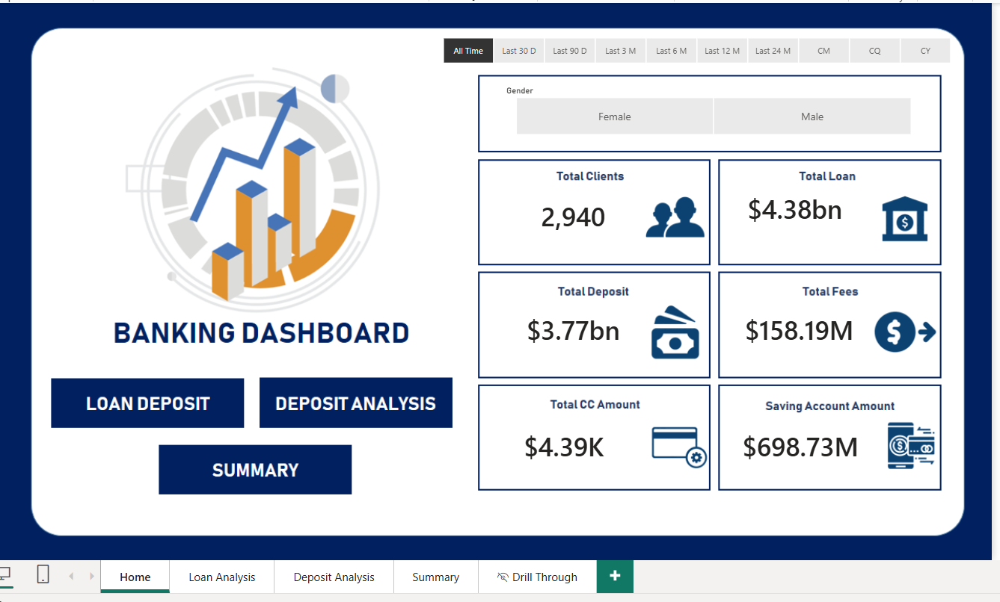
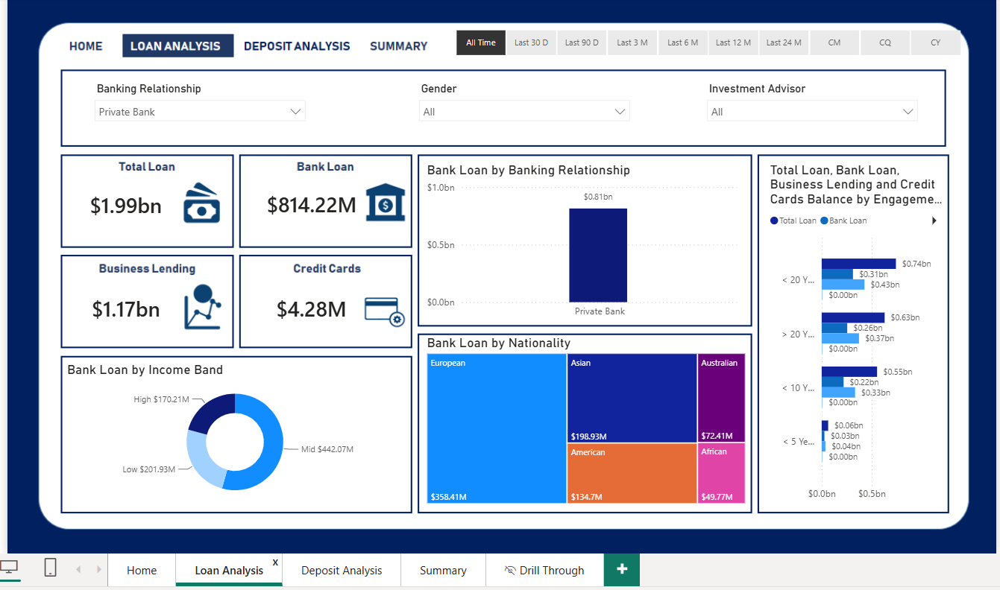
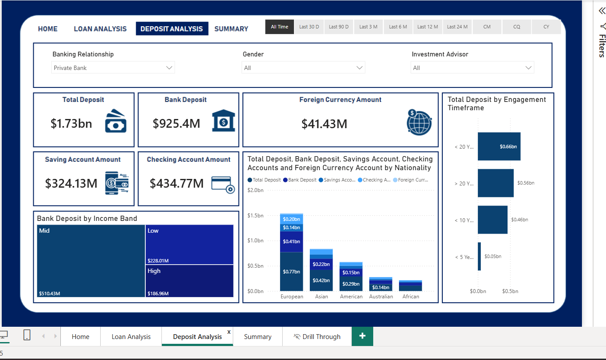
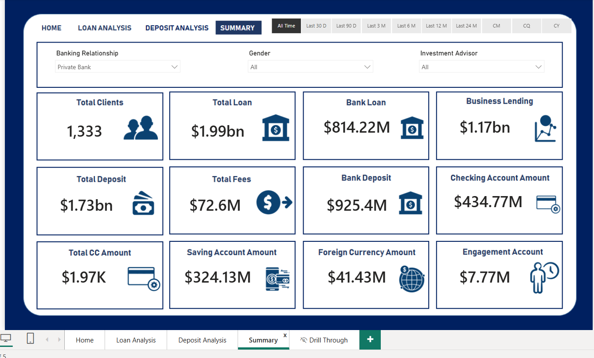
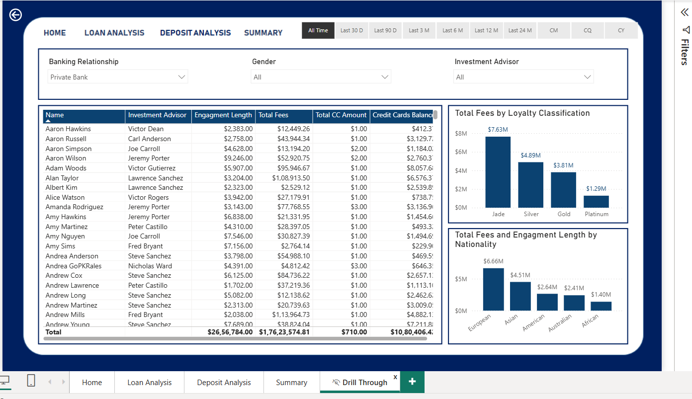

# 🏦 Banking Customer Analysis Dashboard

An end-to-end Banking Analytics project that demonstrates the complete data analytics workflow, from database creation and data preparation in **SQL Server**, to data exploration in **Python**, and finally building an interactive business intelligence dashboard in **Power BI**.

The project provides insights into customer demographics, loans, deposits, banking relationships, customer engagement, and financial performance through interactive visualizations and business KPIs.

---

## 📌 Project Overview

Financial institutions manage large volumes of customer and transactional data. Extracting meaningful insights from this data is essential for understanding customer behavior, monitoring financial products, and supporting business decisions.

This project follows a complete analytics pipeline:

- Database design and data preparation using SQL Server
- Data extraction from SQL Server into Python
- Exploratory Data Analysis (EDA)
- Interactive dashboard development using Power BI
- Business KPI creation using DAX

---

# 📊 Analytics Workflow

```text
CSV Dataset
      │
      ▼
SQL Server
(Database Creation & Data Cleaning)
      │
      ▼
Python
(SQL Server Connection & Data Loading)
      │
      ▼
Python
(Exploratory Data Analysis)
      │
      ▼
Power BI
(Interactive Dashboard & Business Insights)
```

---

# 🎯 Business Objective

The objective of this project is to help banking stakeholders analyze customer information, lending activities, deposits, and financial performance through interactive dashboards.

The dashboard enables users to:

- Analyze customer demographics
- Monitor loan and deposit portfolios
- Compare banking relationships
- Segment customers by income
- Evaluate customer engagement
- Analyze investment advisor performance
- Monitor important banking KPIs

---

# 🛠 Tech Stack

| Technology | Purpose |
|------------|---------|
| SQL Server | Database Design & Data Preparation |
| Python | Data Loading & Exploratory Data Analysis |
| Pandas | Data Manipulation |
| NumPy | Numerical Computing |
| Matplotlib | Data Visualization |
| Seaborn | Statistical Visualization |
| Power BI | Dashboard Development |
| DAX | Business Metrics & KPI Calculations |

---

# 📂 Repository Structure

```text
banking-customer-analysis-dashboard/

│
├── Dashboard/
│   └── Banking Dashboard.pbix
│
├── Data/
│   └── Banking_csv_file.csv
│
├── SQL/
│   ├── 01_Create_Table.sql
│   ├── 02_Insert_Data.sql
│   ├── 03_Update_Data.sql
│   └── 04_Debug_Insertion_Error.sql
│
├── Python/
│   ├── 01_SQL_Server_Data_Loading.ipynb
│   └── 02_Exploratory_Data_Analysis.ipynb
│
├── Images/
│   ├── Home.png
│   ├── Loan_Analysis.png
│   ├── Deposit_Analysis.png
│   ├── Summary.png
│   └── Drill_Through.png
│
├── Report/
│   └── Banking_Report.pdf
│
├── requirements.txt
└── README.md
```

---

# 🗄 SQL Server

The SQL component of the project covers the complete database preparation workflow.

### Database Tasks

- Created the banking database schema
- Defined appropriate data types
- Imported CSV data into SQL Server
- Cleaned and transformed raw data
- Fixed data type conversion issues
- Added calculated attributes
- Updated categorical values
- Prepared clean tables for analysis

SQL Scripts Included:

- Create database tables
- Import data
- Update and transform data
- Debug insertion and conversion errors

---

# 🐍 Python

Python was used in two stages of the analytics workflow.

## 1. SQL Server Connection & Data Loading

The first notebook demonstrates how Python connects with SQL Server using **pyodbc**.

Tasks performed:

- Connect to SQL Server
- Execute SQL queries
- Retrieve data into Pandas DataFrames
- Validate imported data
- Prepare data for analysis

Libraries used:

- pyodbc
- SQLAlchemy
- Pandas

---

## 2. Exploratory Data Analysis (EDA)

The second notebook focuses on understanding and analyzing the dataset before dashboard development.

Analysis performed:

- Missing value analysis
- Descriptive statistics
- Categorical analysis
- Numerical analysis
- Income band creation
- Distribution analysis
- Correlation analysis
- Data visualization

Libraries used:

- Pandas
- NumPy
- Matplotlib
- Seaborn

---

# 📊 Dashboard Pages

## 🏠 Home Dashboard

Provides an overview of the banking business through high-level KPIs.

### KPIs

- Total Clients
- Total Loan
- Total Deposit
- Total Fees
- Total Credit Cards
- Savings Account Amount



---

## 💰 Loan Analysis

Analyzes customer lending patterns.

Features:

- Loan by Banking Relationship
- Loan by Nationality
- Loan by Income Band
- Business Lending
- Credit Card Balance
- Customer Engagement Analysis



---

## 💳 Deposit Analysis

Analyzes customer deposit behavior.

Features:

- Bank Deposits
- Savings Accounts
- Checking Accounts
- Foreign Currency Accounts
- Deposit by Income Band
- Deposit by Nationality
- Deposit by Engagement Timeframe



---

## 📈 Summary Dashboard

Executive overview of the most important banking KPIs.

Includes:

- Total Clients
- Total Loan
- Total Deposit
- Bank Deposit
- Business Lending
- Checking Account Amount
- Foreign Currency Amount
- Customer Engagement



---

## 🔍 Drill Through

Customer-level analysis with detailed records.

Includes:

- Customer Information
- Investment Advisor
- Engagement Length
- Credit Card Balance
- Total Fees
- Nationality-wise Analysis



---

# 📐 Key DAX Measures

- Total Clients
- Total Loan
- Total Deposit
- Total Fees
- Bank Loan
- Business Lending
- Bank Deposit
- Savings Account
- Checking Account
- Foreign Currency Amount
- Credit Card Balance
- Engagement Length

---

# 💡 Key Insights

- Customer segmentation enables comparison of banking products across income groups.
- Loan and deposit portfolios can be analyzed by banking relationship, nationality, and customer engagement.
- Interactive filtering allows users to explore banking performance dynamically.
- Executive KPIs provide a consolidated overview of customer and financial metrics.

---

# 🚀 Future Enhancements

- Connect to a live SQL Server database.
- Automate data refresh.
- Add predictive analytics using machine learning.
- Publish dashboards through Power BI Service.
- Expand the dashboard with additional banking KPIs and trend analysis.

---

## 👨‍💻 Author

**[Saransh-Saurav](https://github.com/Saransh-Saurav)**

If you found this project useful, consider giving it a ⭐.
